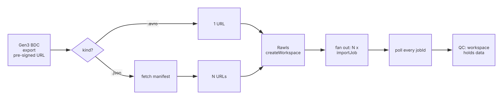
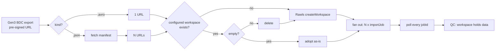

# The import flow

What this tool automates, endpoint by endpoint. The **reference of record** is
[`recorded.har`](../recorded.har) — a real browser capture of Terra importing one pre-signed Gen3
BioData Catalyst export (prod, 2026-09-21). Where this document and the capture disagree, the
capture is right; `tests/test_har_conformance.py` reads the capture rather than restating it, so the
disagreement surfaces as a test failure.

## The two shapes

A Gen3 BDC export hands the researcher **one pre-signed URL**. It is either:

| Shape | URL | Terra does |
|---|---|---|
| `avro` | `…/export_<timestamp>.avro?X-Amz-…` | one `importJob` |
| `manifest` | `…/manifest.json?X-Amz-…` | fetch, expand to N URLs, **N** `importJob` calls |

The manifest shape is a **client-side fan-out**. Terra's import service has no notion of a manifest:
the UI reads the manifest itself and posts one job per URL into the same workspace. That is why this
tool does the same thing, and why the fan-out — not the manifest parsing — is the behaviour under
study.

A one-entry manifest and a bare Avro URL produce an identical `importJob`. There is deliberately no
single-file code path.





## Step by step

### 1. Build the request

**avro** — nothing is fetched. The URL is the request.

**manifest** — `GET <signed manifest url>`, with **no bearer token** and **no redirects followed**
(`safety.fetch_signed_json`). The signature in the query string *is* the authorization; sending a
Terra token would hand a Terra credential to an S3 host, and following a redirect would move the
still-signed URL to a host nobody allow-listed. Provenance is checked **before** the request, so an
off-list URL is never dereferenced at all.

The body is normalised from any shape terra-ui accepts — `{"urls": [...]}`, `{"files": [{"url":…}]}`,
`{"url": …}`, or a bare list — then every expanded URL must satisfy the **same** allow-list as the
manifest that named them, and pass the host allow-list mirroring cWDS's
`twds.data-import.allowed-hosts`.

All of that happens before any job is created. **A request that is not fully importable creates zero
jobs** — the alternative is a half-populated workspace that looks like a service failure rather than
bad input.

> **The allow-list detail that matters.** BDC serves exports from
> `gen3-biodatacatalyst-nhlbi-nih-gov-pfb-export.s3.amazonaws.com` — **virtual-hosted-style** S3,
> with the bucket in the host. A host allow-list written for path-style `s3.amazonaws.com/<bucket>/`
> matches none of it and rejects every real BDC export.

### 2. Resolve the workspace

The destination is **named in config**, not generated per run: `default_workspace_name` on the tier,
alongside `terra_billing_project` (the namespace). One configured workspace is reused across runs, so
a pile of result workspaces no longer accumulates and the workspace an operator goes to look at is
the same one every time.

Reuse is only safe if the run starts from a **known-empty** workspace, because the whole of QC (step
5) is "did entities arrive?" — entities left over from a previous run would read as this run's
success. So the workspace is resolved, not blindly created:

```
GET  /api/workspaces/<ns>/<name>                     # does it exist?
GET  /api/workspaces/<ns>/<name>/entities            # ... and is it empty?  {} == empty
DELETE /api/workspaces/<ns>/<name>                   # only if it is not empty
POST /api/workspaces                                 # create, or re-create after the delete
```

| State of the configured workspace | What happens |
|---|---|
| does not exist (`404`) | `POST /api/workspaces` — create it |
| exists, `entities` returns `{}` | **adopt it as-is**; no create, no delete |
| exists, `entities` is non-empty | `DELETE`, then `POST /api/workspaces` — a fresh, empty workspace under the same name |
| exists but unreadable (`403`) | fail fast — this is someone else's workspace, not ours to empty |

**Emptiness is defined by the entities endpoint**, the same call QC uses in step 5 — deliberately, so
"empty" at the start and "has data" at the end are the same measurement and cannot disagree.
Notebooks, method configs and bucket files are *not* consulted: they are not what the import writes
and not what QC reads.

**The delete is the destructive step in this tool.** It removes a workspace and its bucket, and it is
aimed by a config value, so it is gated: it fires only against the configured
`terra_billing_project/default_workspace_name` pair, never a name derived from the import URL, and
never as a fallback for a failed create. A delete followed by a failed re-create leaves nothing —
which is the correct outcome, and better than fanning N jobs into a workspace with unknown prior
contents.

`POST /api/workspaces` (Rawls) sends `authorizationDomain: []` and `enhancedBucketLogging: true`.
createWorkspace provisions a GCS bucket and is the slow call. Under load the POST can read-time-out
client-side or draw a 5xx from a proxy in front of Rawls *even though the workspace was created*. On
a timeout or 5xx, `pipeline._create_workspace_resilient` GETs the workspace and adopts it if it
exists; a definitive 4xx (409 name-exists, 403 no-access) stays fail-fast. Abandoning a workspace
that actually exists costs the whole run here, because the workspace is resolved once and then N jobs
fan out into it.

> **What the capture actually shows — and where this document used to be wrong.**
>
> `recorded.har` contains **no `POST /api/workspaces` and no `DELETE`**; its only methods are `GET`
> and `POST`, and the sole POST to Rawls-or-Orchestration is the `importJob`. The UI imported into
> `biodata-catalyst/ek_sept_17_1000_gen`, a workspace **created four days earlier**
> (`createdDate 2026-09-17`, import `2026-09-21`) and picked from the workspace list. Reusing a
> named, pre-existing workspace is therefore the *recorded* behaviour; creating one per run was not.
>
> That workspace was **empty**: `GET …/entities` returned `{}`. The capture backs the emptiness
> precondition but says nothing about how to restore it — the delete-and-recreate branch is this
> tool's own policy, unwitnessed by any capture, and should be treated as such.
>
> It also carried a **non-empty** `authorizationDomain` — `[{"membersGroupName":
> "federal_data_lockdown"}]` — already present on a four-day-old workspace, so the capture does not
> show the import applying it. Two consequences. First, the old claim here that "the import applies
> the real auth domain, a privileged operation this tool verifies, never performs" is unsupported by
> the capture; the tool can verify the domain it finds, but must not assert where it came from.
> Second, the adopt path's existing safety rule — refuse a workspace whose `authorizationDomain` is
> non-empty (`rawls.workspace_auth_domains`) — **would reject the exact workspace the capture uses.**
> That rule is right for "did my own POST land?" and wrong for "is the configured workspace mine to
> use"; the two paths need different checks, and a controlled-access destination will legitimately
> have a domain.

### 3. Fan out

Per URL, **before any submit**, `safety.verify_pfb_handoff` pins the destination to the tier's
canonical Firecloud host and the source to the allow-listed bucket. Then, once per URL:

```
POST /api/workspaces/<ns>/<name>/importJob
{"url": "<signed url>", "filetype": "pfb", "options": null}
-> 202 {"jobId": "...", "url": "...", "workspace": {...}}
```

Two details taken straight from the capture:

- **`options` is sent even when null.** It is easy to treat as omittable; no recorded client omits
  it.
- **The 202 carries no `status`.** A client that read `status` off the submit response would record
  an empty string as the job's first observed state. The fan-out seeds `Pending` itself.

Pacing is a parameter (`DispatchPolicy`), because whether the production fan-out should be unbounded,
capped or serialised is an open product question:

| `--dispatch` | Behaviour |
|---|---|
| `parallel` (default, `--max_worker N`) | up to N **jobs in flight**; a worker holds its slot until its job is terminal |
| `sequential` | post one at a time, then poll them all |
| `sequential-await` | post job *i+1* only after job *i* is terminal |

The max_worker bounds jobs in flight rather than POSTs on purpose: it exists to bound concurrency inside
cWDS and the workspace policy updates that follow, and capping POSTs alone would bound neither.

**A rejected submit kills that job only.** If job 4 of 10 is rejected, jobs 1–3 are already running
inside cWDS and cannot be recalled, so the result carries the jobs it has plus the error on the one
it does not — exactly the state the UI has to render.

### 4. Poll

```
GET /api/workspaces/<ns>/<name>/importJob/<jobId>      -> {"filetype","jobId","status"}
GET /api/workspaces/<ns>/<name>/importJob?running_only=true  -> [ ... ]
```

The capture shows the UI calling the **list** endpoint once after the submit, then polling the
**per-job** endpoint every ~5 s until `Done`. Both are implemented (`--poll-strategy per_job|list`)
because running them against the same import and comparing the answers is the only check anywhere
that Orchestration's two status endpoints do not diverge.

Status vocabulary (from terra-ui's `ImportStatus.tsx`):

| | Statuses |
|---|---|
| non-terminal | `Pending`, `Translating`, `ReadyForUpsert`, `Upserting`, `RUNNING`, `CREATED`, `QUEUED` |
| terminal success | `Done`, `SUCCEEDED` |
| terminal failure | `Error`, `ERROR` |
| synthesised locally | `TIMEOUT` |

Three rules that are easy to get wrong:

- **A 404 from the status endpoint is pending, not an error.** Orchestration can be asked about a
  jobId before it knows of it — under a wide fan-out this happens routinely on the first tick.
- **An unrecognised status is a terminal failure**, never a skip. If Orchestration starts returning
  something new, that is the regression this tool exists to catch. It is reported on its own axis so
  it is not confused with the import having gone wrong.
- **`Upserting` must never reach a client.** Seeing it means Orchestration's status translation
  regressed.

Each job carries its **own** deadline, so one hung job cannot consume the others' budget — the
difference between reporting "1 of 8 hung" and reporting nothing.

The capture's own sequence is `ReadyForUpsert` on every poll, then `Done`. `Pending` and
`Translating` are simply too short-lived to be sampled at 5 s, which is why history is asserted as a
**prefix-valid subsequence** rather than an exact path.

### 5. QC

`GET /api/workspaces/<ns>/<name>/entities` (Rawls) → `{entityType: {count, attributeNames, idName}}`.
One call, whatever the fan-out width. It is the **same call step 2 used** to establish the workspace
was empty before the fan-out, which is what licenses reading entities as evidence about *this* run
rather than about whatever the workspace held before it.

The verdict has three axes: **jobs** (every job that was supposed to run succeeded), **data** (the
workspace holds entities), **status vocabulary** (nothing unknown or forbidden was observed).

What it does **not** verify — stated inside every report, not just here: row counts against any
source of truth, column or value correctness, entity relationships, or whether two PFBs that share
ids merged as intended. There is no source of truth to compare against; a pre-signed export is not a
snapshot with a queryable origin. A PASS means every job finished and data arrived.

## Re-capturing the traffic

When an API drifts, re-capture rather than guess. Record the interactive flow in Chrome DevTools,
export as HAR, and scrub it with `scripts/scrub_har.py` before storing or sharing it — a raw capture
contains bearer tokens and signed URLs. **Do not modify `recorded.har`**; add a new capture beside
it and update `tests/test_har_conformance.py` to read the new one.
